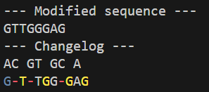

# The chaosDNA utility for generating randomly mutated DNA sequences

## How to run
Download the latest version from "Releases"; extract the archive, and run `chaosDNA.bat`. Note: your browser may warn you that the download is unsafe, and Windows Defender may ask you to ensure you trust the application. This is due to the fact that `chaosDNA.bat` executes `chaosDNA.exe`, and executable files have the potential to modify system files or pose other threats. However, chaosDNA is perfectly safe and simply uses the command line as an I/O interface.

Alternatively, you can download the source code and use standard Rust commands (i.e., `cargo build` and `cargo run`) to run the project in the command line. If using VS Code, you can run the code in the integrated terminal, which can be opened with the ``CTRL-SHIFT-` ``keyboard shortcut.

## Probability modifications
The `ins_prob`, `del_prob`, and `mod_prob` variables (defined near the top of main.rs) control the probabilities of an insertion, a deletion, and/or a mutation error occuring at each index.  The default probabilities are set to 0.2, 0.2, and 0.3 respectfully; however, these can be modified for any value between 0 and 1.

## Output style
An example output for the input "AGAGATACGAGCCA" is the following:

Under "--- Modified Sequence ---", the randomly mutated sequence is outputted; under "--- Changelog ---", the original sequence and randomly mutated sequence are aligned. The same mutated sequence is presented here with colour-coded formatting to display how the original sequence has been modified. At points where an insertion occured, a space is added to the original sequence to preserve alignment, and at points where a deletion occured, a "-" is added to the modified sequence. 

In the modified sequence:
1. Blue bases represent a mutation (base swap) error
2. Yellow bases represent an insertion
3. Red dashes (-) represent a deletion